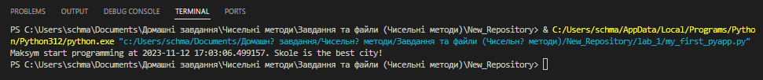
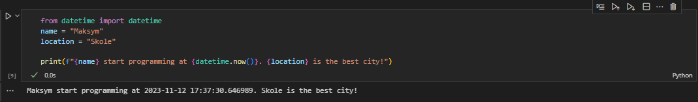
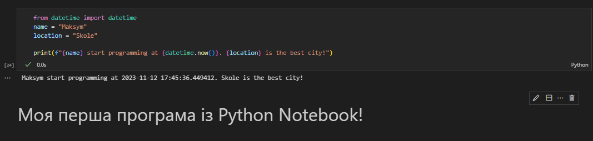

# Звіт до роботи №3
## Тема: Оформлення робіт та перша програма
### Мета роботи: Створити та запустити всою першу програму. 
---
### Виконання роботи
- Результати виконання завдання 1:
    1. Створили перший файл Python у папці `lab_1` з ім'ям `my_first_pyapp.py`.
    1. Програма вивела наступні значення:
    
    *Maksym start programming at 2023-11-12 17:03:06.499157. Skole is the best city!*

    Це також можна побачити на скіршоті нижче:

    1. вставлені рисунки (скріншоти екрана або фотографії виконаного завдання у зошиті);



- Робота з Python Notebook:
    1. Створили перший файл Python з розширенням `.ipynb` у папці `lab_1` з ім'ям `my_first_pyapp.ipynb`.
    1. Програма вивела наступні значення:
    
    *Maksym start programming at 2023-11-12 17:37:30.646989. Skole is the best city!*

    Це також можна побачити на скіршоті нижче:

    1. вставлені рисунки (скріншоти екрана або фотографії виконаного завдання у зошиті);



- Робота з Markdown:
    1. Створили комірку Markdown у файлі з ім'ям `my_first_pyapp.py`.
    1. Описали вище наведений код як:
    
    *Моя перша програма із Python Notebook!*

    1. Натиснули `RunAll` та прослідкували як змінився вигляд Notebook.
    1. Зробили опис коду у вигляді заголовку, тобто додали до Markdown знак `#` на початок комірки.

    Результат можна побачити на скіршоті нижче:

    1. вставлені рисунки (скріншоти екрана або фотографії виконаного завдання у зошиті);



- вставлений код / текстовий або числовий результат / інші результати:
```python
print("Привіт! Це проста програма на Python.")

name = input("Будь ласка, введіть ваше ім'я: ")

print(f"Приємно познайомитися, {ім_я}!")
```
```text
Пояснення коду:

1. print("Привіт! Це проста програма на Python."): Цей рядок виводить привітання на екран за допомогою функції print().

2. ім_я = input("Будь ласка, введіть ваше ім'я: "): Цей рядок використовує функцію input(), щоб запросити користувача ввести своє ім'я. Введені дані зберігаються у змінній ім_я.

3. print(f"Приємно познайомитися, {ім_я}!"): Цей рядок виводить персоналізоване привітання, використовуючи значення, введене користувачем, за допомогою форматування рядка (f-строки).
```

### Висновок: 
- :question: Що зроблено в роботі :arrow_down: У цій роботі ми створили свій перший Python-файл та запрограмували свою прешу програму на мові Python у нашому репозиторію GitHub.
- :question: Чи досягнуто мети роботи :arrow_right: 
- :question: Які нові знання отримано :arrow_right:
- :question: Чи вдалось відповісти на всі питання задані в ході роботи :arrow_right:
- :question: Чи вдалося виконати всі завдання :arrow_right:
- :question: Чи виникли складності у виконанні завдання :arrow_right:
- :question: Чи подобається такий формат здачі роботи (Feedback) :arrow_right:
- :question: Побажання для покращення (Suggestions) :arrow_right: 
---