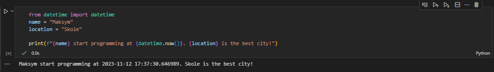
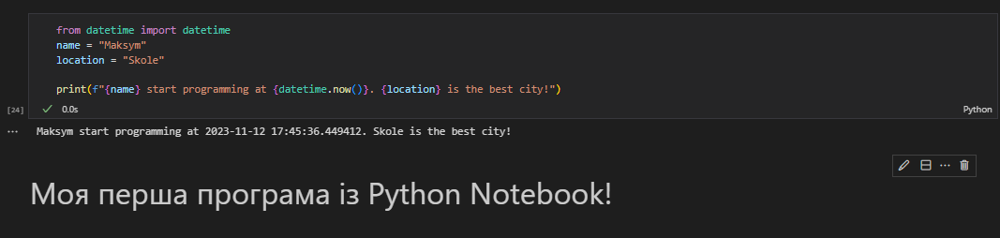

# Звіт до роботи №4
## Тема: Основи програмування на Python
### Мета роботи: 
Освоєння основних концепцій мови програмування Python та набуття практичних навичок в їх використанні.

---
### Виконання роботи
- Підготовка до роботи:
    1. Для зручності створили нову папку `lab_2` та новий файл Python з ім'ям `base_python.py`. Я обрав саме формат *.py*, оскільки він для мене зручніший та є стандартним за структурою.

- Результати виконання завдання i - "Познайомитись з основними типами даних.":
    
    1. Ми створили декілька змінних та присвоїли кожній різні типи даних, що використовує Python.
    1. За допомогою print() ми змогли протестувати, якими особливостями володіє кожен тип даних та як вони виводяться:

    ```python
    a = "Це змінна з текстом, у якій я збережу своє ім'я: Максим!"
    print(a)
    
    b = 1
    print("Ціле число =", b)

    c = ["a", 1, 1.25, "Сонечко"]
    print("Список різних типів даних:", c)

    d = {"a": "Коляда", "b": 1}
    print("Словник різних значень та ключів до них:", d)

    e = ("a",)
    print("Кортеж з одним елементом:", e)

    f = {"ss",}
    print("Множина із одним елементом:", f, end='\n\n')   
    ```

    ```text
    Змінна a є рядком. Рядок представляє собою послідовність символів у лапках.

    Змінна b є змінною цілого числа (Integer).

    Змінна c є списком, що може містити елементи різних типів.

    Змінна d представляє словник, який має ключі та значення.

    Змінна e є кортежем. Кортеж з одним елементом повинен мати кому після цього елемента.

    Змінна f є множиною, також має кому після єдиного елемента.
    ```
    Глянувши на результати, які можна знайти на скіршоті нижче, ми можемо зауважити, що такі типи даних як списки та 
- Робота з Python Notebook:
    1. Створили перший файл Python з розширенням `.ipynb` у папці `lab_1` з ім'ям `my_first_pyapp.ipynb`.
    1. Програма вивела наступні значення:
    
    *Maksym start programming at 2023-11-12 17:37:30.646989. Skole is the best city!*

    Це також можна побачити на скіршоті нижче:

    * вставлені рисунки (скріншоти екрана або фотографії виконаного завдання у зошиті);



- Робота з Markdown:
    1. Створили комірку Markdown у файлі з ім'ям `my_first_pyapp.py`.
    1. Описали вище наведений код як:
    
    *Моя перша програма із Python Notebook!*

    1. Натиснули `RunAll` та прослідкували як змінився вигляд Notebook.
    1. Зробили опис коду у вигляді заголовку, тобто додали до Markdown знак `#` на початок комірки.

    Результат можна побачити на скіршоті нижче:

    * вставлені рисунки (скріншоти екрана або фотографії виконаного завдання у зошиті);



- вставлений код / текстовий або числовий результат / інші результати:
```python
print("Привіт! Це проста програма на Python.")

name = input("Будь ласка, введіть ваше ім'я: ")

print(f"Приємно познайомитися, {ім_я}!")
```
```text
Пояснення коду:

1. print("Привіт! Це проста програма на Python."): Цей рядок виводить привітання на екран за допомогою функції print().

2. ім_я = input("Будь ласка, введіть ваше ім'я: "): Цей рядок використовує функцію input(), щоб запросити користувача ввести своє ім'я. Введені дані зберігаються у змінній ім_я.

3. print(f"Приємно познайомитися, {ім_я}!"): Цей рядок виводить персоналізоване привітання, використовуючи значення, введене користувачем, за допомогою форматування рядка (f-строки).
```

### Висновок: 
- :question: Що зроблено в роботі :arrow_down: 

У цій роботі ми створили свій перший *Python*-файл та запрограмували свою прешу програму мовою *Python* у нашому репозиторію *GitHub*. Ми запустили програму та отримали правильний результат, а також визначили, що наша перша програма працює. Далі ми створили *Python Notebook* файл, у якому запустили ту саму програму та за допомогою комірки *Markdown* описали нашу програму. Наприкінці ми відредагували наш *Markdown* так, щоб він виглядав як заголовок.
- :question: Чи досягнуто мети роботи :arrow_down: 

Так, ми навчилися працювати із базовими засобами Python у Visual Studio Code. Ознайомились із роботою у Python Notebook та навчитися працювати із коміркою Markdown.
- :question: Які нові знання отримано :arrow_down:

Я отримав базові знання про роботу з Python у середовищі Visual Studio Code.
- :question: Чи вдалось відповісти на всі питання задані в ході роботи :arrow_down:

Так, на всі питання були дані повноцінні відповіді.
- :question: Чи вдалося виконати всі завдання :arrow_down:

Так, всі завдання були опрацьовані та виконані.
- :question: Чи виникли складності у виконанні завдання :arrow_down:

Ні, виконання лабораторної роботи було безперешкодним.
- :question: Чи подобається такий формат здачі роботи (Feedback) :arrow_down:

Так, це достатньо простий та комплексний формат здачі завдання, у якому можна достатньо легко показати результати виконаних завдань.
- :question: Побажання для покращення (Suggestions) :arrow_down:

Немає!

---