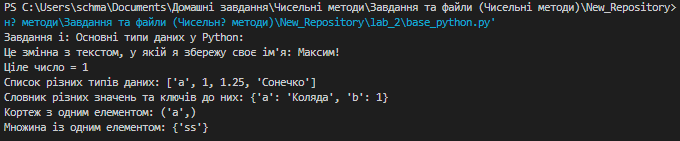
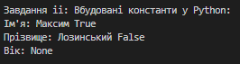
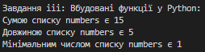
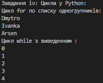
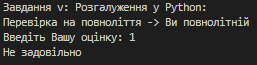
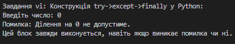
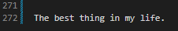

# Звіт до роботи №4
## Тема: Основи програмування на Python
### Мета роботи: 
Освоєння основних концепцій мови програмування Python та набуття практичних навичок в їх використанні.

---
### Виконання роботи
- Підготовка до роботи:
    1. Для зручності створили нову папку `lab_2` та новий файл Python з ім'ям `base_python.py`. Я обрав саме формат *.py*, оскільки він для мене зручніший та є стандартним за структурою.

1. Результати виконання завдання i - "Познайомитись з основними типами даних" :
    
    1. Ми створили декілька змінних та присвоїли кожній різні типи даних, що використовує Python.
    1. За допомогою `print()` ми змогли протестувати та розібратись, яким чином зберігаються дані різних типів у Python

    ```python
    a = "Це змінна з текстом, у якій я збережу своє ім'я: Максим!"
    print(a)
    
    b = 1
    print("Ціле число =", b)

    c = ["a", 1, 1.25, "Сонечко"]
    print("Список різних типів даних:", c)

    d = {"a": "Коляда", "b": 1}
    print("Словник різних значень та ключів до них:", d)

    e = ("a",)
    print("Кортеж з одним елементом:", e)

    f = {"ss",}
    print("Множина із одним елементом:", f, end='\n\n')   
    ```

    ```text
    Пояснення коду:

    Змінна a є рядком. Рядок представляє собою послідовність символів у лапках.

    Змінна b є змінною цілого числа (Integer).

    Змінна c є списком, що може містити елементи різних типів.

    Змінна d представляє словник, який має ключі та значення.

    Змінна e є кортежем. Кортеж з одним елементом повинен мати кому після цього елемента.

    Змінна f є множиною, також має кому після єдиного елемента.
    ```
    У результаті ми можемо бачити, що всі типи даних зберігаються так, як ми їх присвоюємо.  

    * вставлені рисунки (скріншоти екрана або фотографії виконаного завдання у зошиті);

    

1. Результати виконання завдання ii - "Виведення вбудованих констант" :
    1. Ми використали вбудовану функцію `print()`, у якій вписали певний текст, та присвоїли йому вбудовану константу *True/False*. 
    1. Також існує ще одна вбудована константа - *None*, яка дозволяє дати пусте значення змінній, в нашому випадку - тексту. Її ми також затестували.
    
    ```python
    print("Ім'я: Максим", True)
    print("Прізвище: Лозинський", False)
    
    print("Вік:", None, end='\n\n')
    ```
    ```text
    Пояснення коду:

    True та False: Логічні константи, які представляють істину та хибу відповідно до вказаного тексту.   

    None: Спеціальний об'єкт, що вказує на відсутність значення або "нічого".
    ```
    У результаті можемо зробити висновок, що за допомогою цих вбудованих констант можна легко присвоювати "правильне" або "неправильне" значення змінній, що може пізніше пригодитися у великих проєктах.
    Значення None є важливим у позначенні відсутності значення у змінній, також його можна використовувати, як параметр за замовчуванням, який пізніше може бути легко змінений.

    * вставлені рисунки (скріншоти екрана або фотографії виконаного завдання у зошиті);

    

1. Результати виконання завдання iiі - "Виведення результатів роботи вбудованих функцій" :
    1. Ми створили змінну *numbers*, у яку вписали список цифр. Тепер можемо з нею витворяти, що хочемо :smile:
    1. За допомогою функцій *sum*, *len* та *min* ми ознайомились із використанням вбудованих функцій та протестували, яким чином вони виводяться на екран. 
    
    ```python
    numbers = [1, 2, 3, 4, 5]

    print("Сумою списку numbers є", sum(numbers))

    print("Довжиною списку numbers є", len(numbers))

    print("Мінімальним числом списку numbers є", min(numbers), end='\n\n')
    ```
    ```text
    Пояснення коду:

    Сума sum(): Повертає суму чисел у списку numbers.   

    Довжина len(): Повертає довжину об'єкта, наприклад, кількість елементів у списку numbers.

    Мінімальний елемент min(): Повертає найменше число списку numbers.
    ```
    Отож, на скріншоті можемо бачити, що на екран виводиться вже виконана дія, тому що вбудовані функції вже з самого початку є запрограмовані так, що нам вистачає їх тільки викикати, так вони і зразу зроблять свою справу. 

    * вставлені рисунки (скріншоти екрана або фотографії виконаного завдання у зошиті);

    

1. Результати виконання завдання iv - "Знайомство з циклами" :
    1. Ми створили змінну *classmates*, у яку вписали список із іменами одногрупників. Затестуємо на ній цикл `for`, що буде виводити імена по порядку з нового рядка.
    1. Також, ми створили змінну *count*, яка буде лічильноком для виведення цифр менше 5. Щоб це реалізувати використаємо цикл `while`. 
    
    ```python
    classmates = ["Dmytro", "Ivanka", "Arsen"]

    print("Цикл for по списку одногрупників:")
    for classmate in classmates:
        print(classmate)

    count = 0

    print("Цикл while з виведенням :")
    while count < 5:
        print(count)
        count += 1
    ```
    ```text
    Пояснення коду:
    
    Змінна classmates із списком 3-х одногрупників.   

    Виводиться повідомлення "Цикл for по списку одногрупників:", і запускається цикл for. Для кожного елемента classmate у списку classmates виводиться його ім'я.
    
    Змінна count зі значенням 0.

    Виводиться повідомлення "Цикл while з виведенням:". Починається цикл while, який виконується, доки значення count менше 5. На кожній ітерації виводиться поточне значення count, і count збільшується на 1.
    ```
    На скріншоті можемо бачити, що обидва цикли виконали свою роботу. Це достатньо першокласний спосіб використання циклів, в основному цикли виконують набагато важчі завдання. 

    * вставлені рисунки (скріншоти екрана або фотографії виконаного завдання у зошиті);

    

1. Результати виконання завдання v - "Знайомство з розгалуженнями" :
    1. Ми створили змінну *age*, у якій зберегли вік 18 років. За допомогою розгалуження `if...else` можемо пройти перевірку, чи ми є повнолітні, чи ні.
    1. Також, ми створили змінну *note*, яка буде нам служити для визначення успішності. Змінна *note* буде зберігати кількість балів, яку ми введемо з клавіатури за допомогою `input`, а далі розгалуження `if...elif..else` зробить свою роботу та визначить рівень успішності за кількістю балів.  
    
    ```python
    age = 18

    print("Перевірка на повноліття -> ", end="")
    if age >= 18:
        print("Ви повнолітній")
    else:
        print("Ви неповнолітній")

    note = int(input("Введіть Вашу оцінку: ")) 

    if note > 89:
        print("Відмінно")
    elif note > 69:
        print("Добре")
    elif note > 49:
        print("Задовільно")
    else:
        print("Не задовільно")
    ```
    ```text
    Змінна age зі значенням 18 (років).

    Виводиться текст "Перевірка на повноліття -> " на екран, але залишає курсор в тому ж рядку (за допомогою параметра end=""). Це означає, що наступний текст виводитиметься на тому ж рядку.
    Умовний оператор (if) перевіряє, чи вік (age) більший або рівний 18.
    Якщо умова if виявиться істинною (тобто якщо вік більший або рівний 18), то виводиться текст "Ви повнолітній".
    Якщо умова if виявиться хибною (тобто якщо вік менший за 18), виконується блок коду, який слідує за else. У блоку else виводиться текст "Ви неповнолітній".
    
    Змінна note: Користувач вводить свою оцінку, яку програма зчитує за допомогою функції input. Ця оцінка зберігається у змінній note після перетворення на ціле число за допомогою int().
    За допомогою розгалуження if-elif-else перевіряється, чи оцінка більша за 89. Якщо умова виконується (істина), виводиться текст "Відмінно".
    Якщо умова з першого if не виконується, програма перевіряє, чи оцінка більша за 69 у блоці elif. Якщо ця умова виконується, виводиться текст "Добре".
    Якщо попередні умови не виконуються, програма перевіряє, чи оцінка більша за 49 у блоці elif. Якщо це так, виводиться текст "Задовільно".
    Якщо жодна з попередніх умов не виконується, виконується блок коду після else, і виводиться текст "Не задовільно".
    ```
    Отже, можемо зауважити, що розгалуження, це дуже потрібний елемент Python, оскільки за допомогою них можна виконувати перевірки, покрокові виконання задач та інше. Результати роботи розгалужень можемо бачити на скріншоті.

    * вставлені рисунки (скріншоти екрана або фотографії виконаного завдання у зошиті);

    

1. Результати виконання завдання vi - "Конструкція try->except->finally" :
    1. При виконанні цього завдання я попросив допомоги у Сhatgpt. Тут ми використовуємо конструкцію try, except і finally для обробки можливих винятків (помилок) під час введення, конвертації введеного рядка в число, та виконання ділення на це число.
    
    ```python
    try:
    num_str = input("Введіть число: ")

    num = int(num_str)

    result = 10 / num

    except ValueError as ve:
        print(f"Помилка: {ve}. Будь ласка, введіть коректне число.")

    except ZeroDivisionError:
        print("Помилка: Ділення на 0 не допустиме.")

    finally:
        print("Цей блок завжди виконується, навіть якщо виникає помилка чи ні.")
    ```
    ```text
    Всі оператори, які можуть призвести до помилки, поміщаються в блок try.

    Якщо в блоку try виникає помилка типу ValueError (наприклад, коли введений рядок не може бути конвертований у число), виконується блок except. Змінна ve буде містити деталі про помилку, і виводиться повідомлення про помилку.

    Якщо в блоку try виникає помилка типу ZeroDivisionError (наприклад, коли користувач вводить 0, а ми намагаємося поділити на 0), виконується цей блок except. Виводиться повідомлення про помилку.

    finally-блок завжди виконується, навіть якщо виникає помилка чи ні. Використовується, наприклад, для виконання завершальних дій, таких як закриття файлу або з'єднання, незалежно від того, чи виникає помилка.
    ```
    Конструкція try, except і finally є достатньо непростим елементом Python, проте він дуже потрібний для сповіщення користувачів при введені неправильних даних чи використання неправильних функцій. На скріншоті можемо побачити, що конструкція видала помилку.   

    * вставлені рисунки (скріншоти екрана або фотографії виконаного завдання у зошиті);

    

1. Результати виконання завдання vii - "Контекст-менеджер with" :
    1. Ми використали конструкцію `with` для безпечного відкриття файлу та додавання тексту до його вмісту. Текст буде додано у кінець вказаного файлу.
    
    ```python
    print("Додаємо текст до існуючого файлу за допомогою with: ")
    with open("lab_2/README.md", "a") as file:
        file.write("\nThe best thing in my life.")
    ```
    ```text
    with open("lab_2/README.md", "a") as file - Цей рядок використовує конструкцію with, яка автоматично закриє файл після виходу з блоку with. Відбувається відкриття файлу "lab_2/README.md" у режимі допису ("a" - від "append", додавання в кінець файлу).
    Файловий об'єкт призначається змінній file.

    Використовуючи метод .write, додається рядок тексту ("\nThe best thing in my life.") в кінець файлу. 
    ```
    Насправді використання Контекст-менеджера `with` є набагато ширшим, проте базове використання поширюєтться тільки на можливості автоматичного відкриття та закриття ресурсів. На скріншотах можемо бачити успішне виконання роботи контекст-менеджера `with`.

    * вставлені рисунки (скріншоти екрана або фотографії виконаного завдання у зошиті);

    
    

### Висновок: 
- :question: Що зроблено в роботі :arrow_down: 

У цій роботі ми створили свій перший *Python*-файл та запрограмували свою прешу програму мовою *Python* у нашому репозиторію *GitHub*. Ми запустили програму та отримали правильний результат, а також визначили, що наша перша програма працює. Далі ми створили *Python Notebook* файл, у якому запустили ту саму програму та за допомогою комірки *Markdown* описали нашу програму. Наприкінці ми відредагували наш *Markdown* так, щоб він виглядав як заголовок.
- :question: Чи досягнуто мети роботи :arrow_down: 

Так, ми навчилися працювати із базовими засобами Python у Visual Studio Code. Ознайомились із роботою у Python Notebook та навчитися працювати із коміркою Markdown.
- :question: Які нові знання отримано :arrow_down:

Я отримав базові знання про роботу з Python у середовищі Visual Studio Code.
- :question: Чи вдалось відповісти на всі питання задані в ході роботи :arrow_down:

Так, на всі питання були дані повноцінні відповіді.
- :question: Чи вдалося виконати всі завдання :arrow_down:

Так, всі завдання були опрацьовані та виконані.
- :question: Чи виникли складності у виконанні завдання :arrow_down:

Ні, виконання лабораторної роботи було безперешкодним.
- :question: Чи подобається такий формат здачі роботи (Feedback) :arrow_down:

Так, це достатньо простий та комплексний формат здачі завдання, у якому можна достатньо легко показати результати виконаних завдань.
- :question: Побажання для покращення (Suggestions) :arrow_down:

Немає!

---

The best thing in my life.