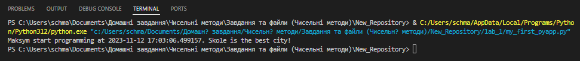

# –ó–≤—ñ—Ç –¥–æ —Ä–æ–±–æ—Ç–∏ ‚Ññ4
## –¢–µ–º–∞: –û—Å–Ω–æ–≤–∏ –ø—Ä–æ–≥—Ä–∞–º—É–≤–∞–Ω–Ω—è –Ω–∞ Python
### –ú–µ—Ç–∞ —Ä–æ–±–æ—Ç–∏: 
–ù–∞–≤—á–∏—Ç–∏—Å—è –ø—Ä–∞—Ü—é–≤–∞—Ç–∏ —ñ–∑ –±–∞–∑–æ–≤–∏–º–∏ –∑–∞—Å–æ–±–∞–º–∏ Python —É Visual Studio Code. –û–∑–Ω–∞–π–æ–º–∏—Ç–∏—Å—å —ñ–∑ —Ä–æ–±–æ—Ç–æ—é —É Python Notebook —Ç–∞ –Ω–∞–≤—á–∏—Ç–∏—Å—è –ø—Ä–∞—Ü—é–≤–∞—Ç–∏ —ñ–∑ –∫–æ–º—ñ—Ä–∫–æ—é Markdown.

---
### –í–∏–∫–æ–Ω–∞–Ω–Ω—è —Ä–æ–±–æ—Ç–∏
- –†–µ–∑—É–ª—å—Ç–∞—Ç–∏ –≤–∏–∫–æ–Ω–∞–Ω–Ω—è –∑–∞–≤–¥–∞–Ω–Ω—è 1:
    1. –°—Ç–≤–æ—Ä–∏–ª–∏ –ø–µ—Ä—à–∏–π —Ñ–∞–π–ª Python —É –ø–∞–ø—Ü—ñ `lab_1` –∑ —ñ–º'—è–º `my_first_pyapp.py`.
    1. –ü—Ä–æ–≥—Ä–∞–º–∞ –≤–∏–≤–µ–ª–∞ –Ω–∞—Å—Ç—É–ø–Ω—ñ –∑–Ω–∞—á–µ–Ω–Ω—è:
    
    *Maksym start programming at 2023-11-12 17:03:06.499157. Skole is the best city!*

    –¶–µ —Ç–∞–∫–æ–∂ –º–æ–∂–Ω–∞ –ø–æ–±–∞—á–∏—Ç–∏ –Ω–∞ —Å–∫—ñ—Ä—à–æ—Ç—ñ –Ω–∏–∂—á–µ:

    * –≤—Å—Ç–∞–≤–ª–µ–Ω—ñ —Ä–∏—Å—É–Ω–∫–∏ (—Å–∫—Ä—ñ–Ω—à–æ—Ç–∏ –µ–∫—Ä–∞–Ω–∞ –∞–±–æ —Ñ–æ—Ç–æ–≥—Ä–∞—Ñ—ñ—ó –≤–∏–∫–æ–Ω–∞–Ω–æ–≥–æ –∑–∞–≤–¥–∞–Ω–Ω—è —É –∑–æ—à–∏—Ç—ñ);



- –†–æ–±–æ—Ç–∞ –∑ Python Notebook:
    1. –°—Ç–≤–æ—Ä–∏–ª–∏ –ø–µ—Ä—à–∏–π —Ñ–∞–π–ª Python –∑ —Ä–æ–∑—à–∏—Ä–µ–Ω–Ω—è–º `.ipynb` —É –ø–∞–ø—Ü—ñ `lab_1` –∑ —ñ–º'—è–º `my_first_pyapp.ipynb`.
    1. –ü—Ä–æ–≥—Ä–∞–º–∞ –≤–∏–≤–µ–ª–∞ –Ω–∞—Å—Ç—É–ø–Ω—ñ –∑–Ω–∞—á–µ–Ω–Ω—è:
    
    *Maksym start programming at 2023-11-12 17:37:30.646989. Skole is the best city!*

    –¶–µ —Ç–∞–∫–æ–∂ –º–æ–∂–Ω–∞ –ø–æ–±–∞—á–∏—Ç–∏ –Ω–∞ —Å–∫—ñ—Ä—à–æ—Ç—ñ –Ω–∏–∂—á–µ:

    * –≤—Å—Ç–∞–≤–ª–µ–Ω—ñ —Ä–∏—Å—É–Ω–∫–∏ (—Å–∫—Ä—ñ–Ω—à–æ—Ç–∏ –µ–∫—Ä–∞–Ω–∞ –∞–±–æ —Ñ–æ—Ç–æ–≥—Ä–∞—Ñ—ñ—ó –≤–∏–∫–æ–Ω–∞–Ω–æ–≥–æ –∑–∞–≤–¥–∞–Ω–Ω—è —É –∑–æ—à–∏—Ç—ñ);


- –†–æ–±–æ—Ç–∞ –∑ Markdown:
    1. –°—Ç–≤–æ—Ä–∏–ª–∏ –∫–æ–º—ñ—Ä–∫—É Markdown —É —Ñ–∞–π–ª—ñ –∑ —ñ–º'—è–º `my_first_pyapp.py`.
    1. –û–ø–∏—Å–∞–ª–∏ –≤–∏—â–µ –Ω–∞–≤–µ–¥–µ–Ω–∏–π –∫–æ–¥ —è–∫:
    
    *–ú–æ—è –ø–µ—Ä—à–∞ –ø—Ä–æ–≥—Ä–∞–º–∞ —ñ–∑ Python Notebook!*

    1. –ù–∞—Ç–∏—Å–Ω—É–ª–∏ `RunAll` —Ç–∞ –ø—Ä–æ—Å–ª—ñ–¥–∫—É–≤–∞–ª–∏ —è–∫ –∑–º—ñ–Ω–∏–≤—Å—è –≤–∏–≥–ª—è–¥ Notebook.
    1. –ó—Ä–æ–±–∏–ª–∏ –æ–ø–∏—Å –∫–æ–¥—É —É –≤–∏–≥–ª—è–¥—ñ –∑–∞–≥–æ–ª–æ–≤–∫—É, —Ç–æ–±—Ç–æ –¥–æ–¥–∞–ª–∏ –¥–æ Markdown –∑–Ω–∞–∫ `#` –Ω–∞ –ø–æ—á–∞—Ç–æ–∫ –∫–æ–º—ñ—Ä–∫–∏.

    –†–µ–∑—É–ª—å—Ç–∞—Ç –º–æ–∂–Ω–∞ –ø–æ–±–∞—á–∏—Ç–∏ –Ω–∞ —Å–∫—ñ—Ä—à–æ—Ç—ñ –Ω–∏–∂—á–µ:

    * –≤—Å—Ç–∞–≤–ª–µ–Ω—ñ —Ä–∏—Å—É–Ω–∫–∏ (—Å–∫—Ä—ñ–Ω—à–æ—Ç–∏ –µ–∫—Ä–∞–Ω–∞ –∞–±–æ —Ñ–æ—Ç–æ–≥—Ä–∞—Ñ—ñ—ó –≤–∏–∫–æ–Ω–∞–Ω–æ–≥–æ –∑–∞–≤–¥–∞–Ω–Ω—è —É –∑–æ—à–∏—Ç—ñ);


- –≤—Å—Ç–∞–≤–ª–µ–Ω–∏–π –∫–æ–¥ / —Ç–µ–∫—Å—Ç–æ–≤–∏–π –∞–±–æ —á–∏—Å–ª–æ–≤–∏–π —Ä–µ–∑—É–ª—å—Ç–∞—Ç / —ñ–Ω—à—ñ —Ä–µ–∑—É–ª—å—Ç–∞—Ç–∏:
```python
print("–ü—Ä–∏–≤—ñ—Ç! –¶–µ –ø—Ä–æ—Å—Ç–∞ –ø—Ä–æ–≥—Ä–∞–º–∞ –Ω–∞ Python.")

name = input("–ë—É–¥—å –ª–∞—Å–∫–∞, –≤–≤–µ–¥—ñ—Ç—å –≤–∞—à–µ —ñ–º'—è: ")

print(f"–ü—Ä–∏—î–º–Ω–æ –ø–æ–∑–Ω–∞–π–æ–º–∏—Ç–∏—Å—è, {—ñ–º_—è}!")
```
```text
–ü–æ—è—Å–Ω–µ–Ω–Ω—è –∫–æ–¥—É:

1. print("–ü—Ä–∏–≤—ñ—Ç! –¶–µ –ø—Ä–æ—Å—Ç–∞ –ø—Ä–æ–≥—Ä–∞–º–∞ –Ω–∞ Python."): –¶–µ–π —Ä—è–¥–æ–∫ –≤–∏–≤–æ–¥–∏—Ç—å –ø—Ä–∏–≤—ñ—Ç–∞–Ω–Ω—è –Ω–∞ –µ–∫—Ä–∞–Ω –∑–∞ –¥–æ–ø–æ–º–æ–≥–æ—é —Ñ—É–Ω–∫—Ü—ñ—ó print().

2. —ñ–º_—è = input("–ë—É–¥—å –ª–∞—Å–∫–∞, –≤–≤–µ–¥—ñ—Ç—å –≤–∞—à–µ —ñ–º'—è: "): –¶–µ–π —Ä—è–¥–æ–∫ –≤–∏–∫–æ—Ä–∏—Å—Ç–æ–≤—É—î —Ñ—É–Ω–∫—Ü—ñ—é input(), —â–æ–± –∑–∞–ø—Ä–æ—Å–∏—Ç–∏ –∫–æ—Ä–∏—Å—Ç—É–≤–∞—á–∞ –≤–≤–µ—Å—Ç–∏ —Å–≤–æ—î —ñ–º'—è. –í–≤–µ–¥–µ–Ω—ñ –¥–∞–Ω—ñ –∑–±–µ—Ä—ñ–≥–∞—é—Ç—å—Å—è —É –∑–º—ñ–Ω–Ω—ñ–π —ñ–º_—è.

3. print(f"–ü—Ä–∏—î–º–Ω–æ –ø–æ–∑–Ω–∞–π–æ–º–∏—Ç–∏—Å—è, {—ñ–º_—è}!"): –¶–µ–π —Ä—è–¥–æ–∫ –≤–∏–≤–æ–¥–∏—Ç—å –ø–µ—Ä—Å–æ–Ω–∞–ª—ñ–∑–æ–≤–∞–Ω–µ –ø—Ä–∏–≤—ñ—Ç–∞–Ω–Ω—è, –≤–∏–∫–æ—Ä–∏—Å—Ç–æ–≤—É—é—á–∏ –∑–Ω–∞—á–µ–Ω–Ω—è, –≤–≤–µ–¥–µ–Ω–µ –∫–æ—Ä–∏—Å—Ç—É–≤–∞—á–µ–º, –∑–∞ –¥–æ–ø–æ–º–æ–≥–æ—é —Ñ–æ—Ä–º–∞—Ç—É–≤–∞–Ω–Ω—è —Ä—è–¥–∫–∞ (f-—Å—Ç—Ä–æ–∫–∏).
```

### –í–∏—Å–Ω–æ–≤–æ–∫: 
- :question: –©–æ –∑—Ä–æ–±–ª–µ–Ω–æ –≤ —Ä–æ–±–æ—Ç—ñ :arrow_down: 

–£ —Ü—ñ–π —Ä–æ–±–æ—Ç—ñ –º–∏ —Å—Ç–≤–æ—Ä–∏–ª–∏ —Å–≤—ñ–π –ø–µ—Ä—à–∏–π *Python*-—Ñ–∞–π–ª —Ç–∞ –∑–∞–ø—Ä–æ–≥—Ä–∞–º—É–≤–∞–ª–∏ —Å–≤–æ—é –ø—Ä–µ—à—É –ø—Ä–æ–≥—Ä–∞–º—É –º–æ–≤–æ—é *Python* —É –Ω–∞—à–æ–º—É —Ä–µ–ø–æ–∑–∏—Ç–æ—Ä—ñ—é *GitHub*. –ú–∏ –∑–∞–ø—É—Å—Ç–∏–ª–∏ –ø—Ä–æ–≥—Ä–∞–º—É —Ç–∞ –æ—Ç—Ä–∏–º–∞–ª–∏ –ø—Ä–∞–≤–∏–ª—å–Ω–∏–π —Ä–µ–∑—É–ª—å—Ç–∞—Ç, –∞ —Ç–∞–∫–æ–∂ –≤–∏–∑–Ω–∞—á–∏–ª–∏, —â–æ –Ω–∞—à–∞ –ø–µ—Ä—à–∞ –ø—Ä–æ–≥—Ä–∞–º–∞ –ø—Ä–∞—Ü—é—î. –î–∞–ª—ñ –º–∏ —Å—Ç–≤–æ—Ä–∏–ª–∏ *Python Notebook* —Ñ–∞–π–ª, —É —è–∫–æ–º—É –∑–∞–ø—É—Å—Ç–∏–ª–∏ —Ç—É —Å–∞–º—É –ø—Ä–æ–≥—Ä–∞–º—É —Ç–∞ –∑–∞ –¥–æ–ø–æ–º–æ–≥–æ—é –∫–æ–º—ñ—Ä–∫–∏ *Markdown* –æ–ø–∏—Å–∞–ª–∏ –Ω–∞—à—É –ø—Ä–æ–≥—Ä–∞–º—É. –ù–∞–ø—Ä–∏–∫—ñ–Ω—Ü—ñ –º–∏ –≤—ñ–¥—Ä–µ–¥–∞–≥—É–≤–∞–ª–∏ –Ω–∞—à *Markdown* —Ç–∞–∫, —â–æ–± –≤—ñ–Ω –≤–∏–≥–ª—è–¥–∞–≤ —è–∫ –∑–∞–≥–æ–ª–æ–≤–æ–∫.
- :question: –ß–∏ –¥–æ—Å—è–≥–Ω—É—Ç–æ –º–µ—Ç–∏ —Ä–æ–±–æ—Ç–∏ :arrow_down: 

–¢–∞–∫, –º–∏ –Ω–∞–≤—á–∏–ª–∏—Å—è –ø—Ä–∞—Ü—é–≤–∞—Ç–∏ —ñ–∑ –±–∞–∑–æ–≤–∏–º–∏ –∑–∞—Å–æ–±–∞–º–∏ Python —É Visual Studio Code. –û–∑–Ω–∞–π–æ–º–∏–ª–∏—Å—å —ñ–∑ —Ä–æ–±–æ—Ç–æ—é —É Python Notebook —Ç–∞ –Ω–∞–≤—á–∏—Ç–∏—Å—è –ø—Ä–∞—Ü—é–≤–∞—Ç–∏ —ñ–∑ –∫–æ–º—ñ—Ä–∫–æ—é Markdown.
- :question: –Ø–∫—ñ –Ω–æ–≤—ñ –∑–Ω–∞–Ω–Ω—è –æ—Ç—Ä–∏–º–∞–Ω–æ :arrow_down:

–Ø –æ—Ç—Ä–∏–º–∞–≤ –±–∞–∑–æ–≤—ñ –∑–Ω–∞–Ω–Ω—è –ø—Ä–æ —Ä–æ–±–æ—Ç—É –∑ Python —É —Å–µ—Ä–µ–¥–æ–≤–∏—â—ñ Visual Studio Code.
- :question: –ß–∏ –≤–¥–∞–ª–æ—Å—å –≤—ñ–¥–ø–æ–≤—ñ—Å—Ç–∏ –Ω–∞ –≤—Å—ñ –ø–∏—Ç–∞–Ω–Ω—è –∑–∞–¥–∞–Ω—ñ –≤ —Ö–æ–¥—ñ —Ä–æ–±–æ—Ç–∏ :arrow_down:

–¢–∞–∫, –Ω–∞ –≤—Å—ñ –ø–∏—Ç–∞–Ω–Ω—è –±—É–ª–∏ –¥–∞–Ω—ñ –ø–æ–≤–Ω–æ—Ü—ñ–Ω–Ω—ñ –≤—ñ–¥–ø–æ–≤—ñ–¥—ñ.
- :question: –ß–∏ –≤–¥–∞–ª–æ—Å—è –≤–∏–∫–æ–Ω–∞—Ç–∏ –≤—Å—ñ –∑–∞–≤–¥–∞–Ω–Ω—è :arrow_down:

–¢–∞–∫, –≤—Å—ñ –∑–∞–≤–¥–∞–Ω–Ω—è –±—É–ª–∏ –æ–ø—Ä–∞—Ü—å–æ–≤–∞–Ω—ñ —Ç–∞ –≤–∏–∫–æ–Ω–∞–Ω—ñ.
- :question: –ß–∏ –≤–∏–Ω–∏–∫–ª–∏ —Å–∫–ª–∞–¥–Ω–æ—Å—Ç—ñ —É –≤–∏–∫–æ–Ω–∞–Ω–Ω—ñ –∑–∞–≤–¥–∞–Ω–Ω—è :arrow_down:

–ù—ñ, –≤–∏–∫–æ–Ω–∞–Ω–Ω—è –ª–∞–±–æ—Ä–∞—Ç–æ—Ä–Ω–æ—ó —Ä–æ–±–æ—Ç–∏ –±—É–ª–æ –±–µ–∑–ø–µ—Ä–µ—à–∫–æ–¥–Ω–∏–º.
- :question: –ß–∏ –ø–æ–¥–æ–±–∞—î—Ç—å—Å—è —Ç–∞–∫–∏–π —Ñ–æ—Ä–º–∞—Ç –∑–¥–∞—á—ñ —Ä–æ–±–æ—Ç–∏ (Feedback) :arrow_down:

–¢–∞–∫, —Ü–µ –¥–æ—Å—Ç–∞—Ç–Ω—å–æ –ø—Ä–æ—Å—Ç–∏–π —Ç–∞ –∫–æ–º–ø–ª–µ–∫—Å–Ω–∏–π —Ñ–æ—Ä–º–∞—Ç –∑–¥–∞—á—ñ –∑–∞–≤–¥–∞–Ω–Ω—è, —É —è–∫–æ–º—É –º–æ–∂–Ω–∞ –¥–æ—Å—Ç–∞—Ç–Ω—å–æ –ª–µ–≥–∫–æ –ø–æ–∫–∞–∑–∞—Ç–∏ —Ä–µ–∑—É–ª—å—Ç–∞—Ç–∏ –≤–∏–∫–æ–Ω–∞–Ω–∏—Ö –∑–∞–≤–¥–∞–Ω—å.
- :question: –ü–æ–±–∞–∂–∞–Ω–Ω—è –¥–ª—è –ø–æ–∫—Ä–∞—â–µ–Ω–Ω—è (Suggestions) :arrow_down:

–ù–µ–º–∞—î!

---
÷ ·Û‰Â ‰Ó‰‡ÌÓ ‰Ó ≥ÒÌÛ˛˜Ó„Ó ‚Ï≥ÒÚÛ.