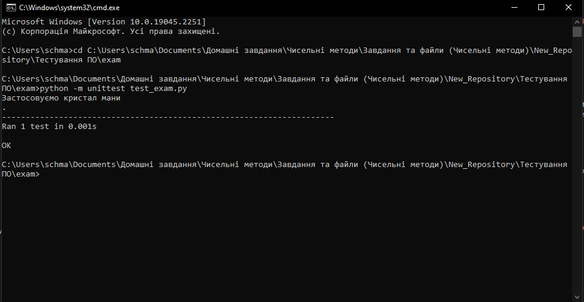

# Екзаменаційна робота №9
### У роботі №2, для файлу game/swords.py протестувати функцію expire_buff з класу SwordsSecond (написати юніт тест)

---
- Виконання роботи:
    1. Створили тестувальний файл під ім'ям `test_exap.py`.
    1. Додали тестовий метод `test_buff_expire()` для повноцінного тестування функції `expire_buff()`.
    1. Використали кодову конструкцію для unittest-тестування.
    1. Провели тестування.

- Результат тестування:

_Всі файли знаходяться у папці `exam`_