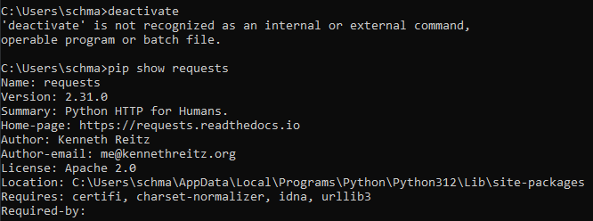
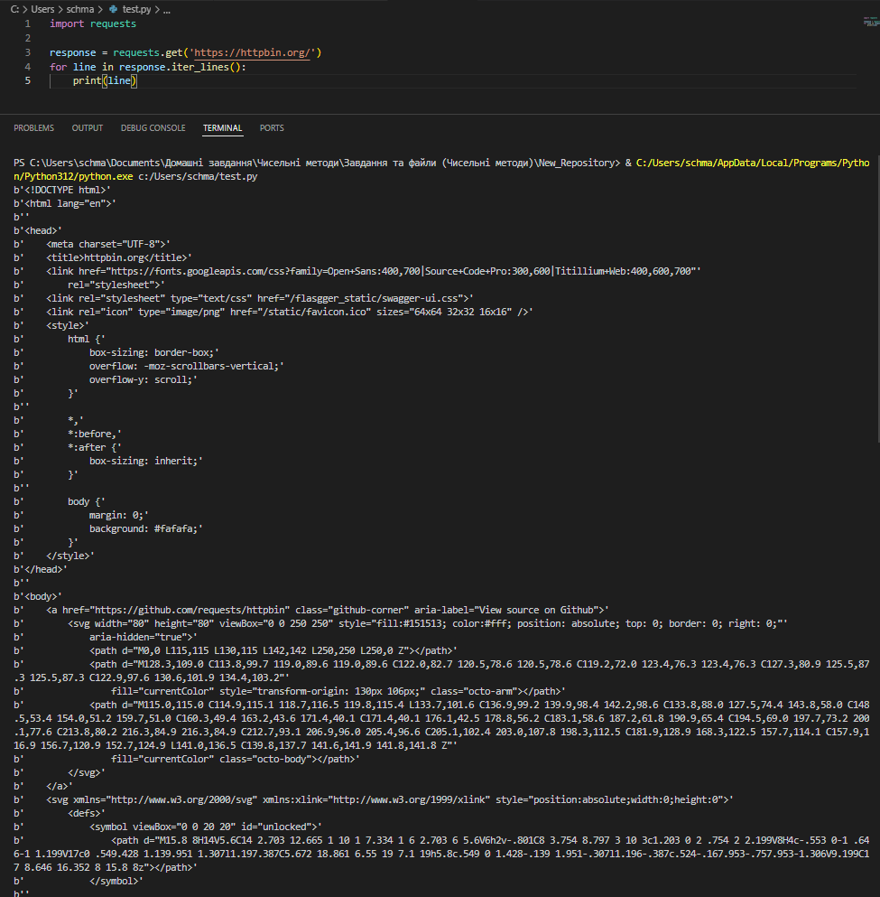
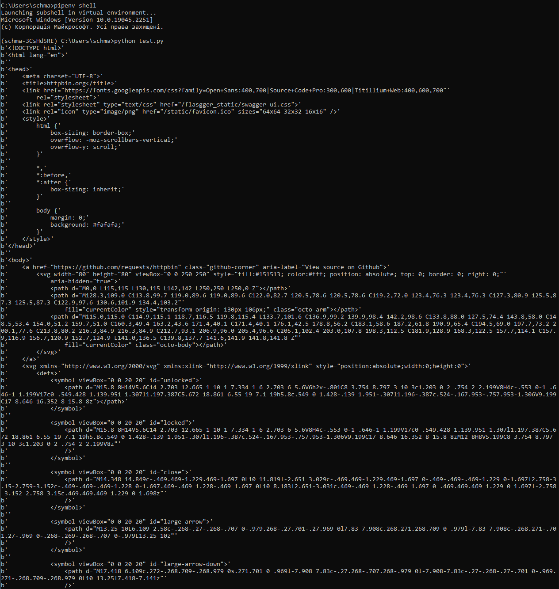
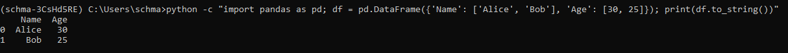
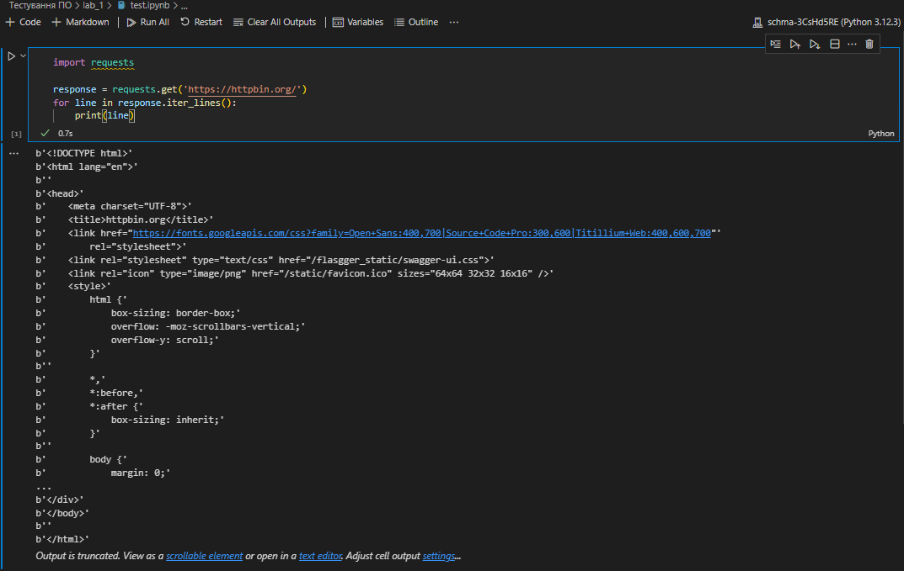
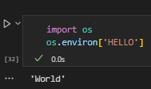
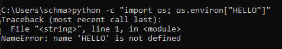
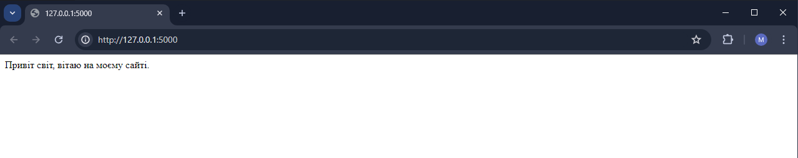

# Звіт до роботи №1
## Тема: Віртуальні середовища
### Мета роботи: 
Ознайомитись із основами віртуальних середовищ та навчитися працювати із ними.

---
### Виконання роботи
1. Результати виконання завдання 1 - "Основи роботи з сторонніми бібліотеками":
    - Перевірили, що pip встановлений на ноутбуці, а саме його версія 24.0
    - Вивели на екран встановленні бібліотеки pip за допомогою команди `pip list`:

    

    - Встановили бібліотеку requests за допомогою команди `pip install requests`:

    

    - Імпортували та протестували її за допомогою команд:

    ```python
    >>> import requests
    >>> r = requests.get('https://google.com')
    >>> r.status_code
    ```

    

    - Зробили її загальнодоступною для цілої системи за допомогою наступних команд:

    ```python
    pip show requests
    pip install requests==2.1
    pip show requests
    pip uninstall requests
    ```
    
      

1. Результати виконання завдання 2 - "Робота у віртуальному середовищі":
    - Створили `VENV` та активували його за допомогою команд:
    
    ```python
    python -m venv ./my_env
    source my_env/Scripts/activate
    pip install requests
    deactivate
    pip show requests
    ```

    - Після нашого запиту команда вивела на екран інформацію про бібліотеку `requests`:

    

1. Результати виконання завдання 3 - "Робота з Pipenv":
    - Завантажили `pipenv` та вивели всі можливості його використання за допомогою `--help`:

    ```
    Usage: pipenv [OPTIONS] COMMAND [ARGS]...

    Options:
    --where                         Output project home information.
    --venv                          Output virtualenv information.
    --py                            Output Python interpreter information.
    --envs                          Output Environment Variable options.
    --rm                            Remove the virtualenv.
    --bare                          Minimal output.
    --man                           Display manpage.
    --support                       Output diagnostic information for use in
                                    GitHub issues.
    --site-packages / --no-site-packages
                                    Enable site-packages for the virtualenv.
                                    [env var: PIPENV_SITE_PACKAGES]
    --python TEXT                   Specify which version of Python virtualenv
                                    should use.
    --clear                         Clears caches (pipenv, pip).  [env var:
                                    PIPENV_CLEAR]
    -q, --quiet                     Quiet mode.
    -v, --verbose                   Verbose mode.
    --pypi-mirror TEXT              Specify a PyPI mirror.
    --version                       Show the version and exit.
    -h, --help                      Show this message and exit.


    Usage Examples:
    Create a new project using Python 3.7, specifically:
    $ pipenv --python 3.7

    Remove project virtualenv (inferred from current directory):
    $ pipenv --rm

    Install all dependencies for a project (including dev):
    $ pipenv install --dev

    Create a lockfile containing pre-releases:
    $ pipenv lock --pre

    Show a graph of your installed dependencies:
    $ pipenv graph

    Check your installed dependencies for security vulnerabilities:
    $ pipenv check

    Install a local setup.py into your virtual environment/Pipfile:
    $ pipenv install -e .

    Use a lower-level pip command:
    $ pipenv run pip freeze

    Commands:
    check         Checks for PyUp Safety security vulnerabilities and against
                    PEP 508 markers provided in Pipfile.
    clean         Uninstalls all packages not specified in Pipfile.lock.
    graph         Displays currently-installed dependency graph information.
    install       Installs provided packages and adds them to Pipfile, or (if no
                    packages are given), installs all packages from Pipfile.
    lock          Generates Pipfile.lock.
    open          View a given module in your editor.
    requirements  Generate a requirements.txt from Pipfile.lock.
    run           Spawns a command installed into the virtualenv.
    scripts       Lists scripts in current environment config.
    shell         Spawns a shell within the virtualenv.
    sync          Installs all packages specified in Pipfile.lock.
    uninstall     Uninstalls a provided package and removes it from Pipfile.
    update        Runs lock, then sync.
    upgrade       Resolves provided packages and adds them to Pipfile, or (if no
                    packages are given), merges results to Pipfile.lock
    verify        Verify the hash in Pipfile.lock is up-to-date.
    ```

    - Створили нове середовище та інсталювали бібліотеку `requests` у ньому, а також переконались що наприкінці установки були створені файли `Pipfile` та `Pipfile.lock`. `Pipfile` та `Pipfile lock` - це два файли, які використовуються для керування залежностями Python за допомогою інструменту pip.

    - `Pipfile` містить декларацію залежностей власного проєкту. 
    `Pipfile.lock` - це файл, який генерується `pip` на основі `Pipfile`. Він містить список усіх пакетів, які були встановлені у нашому середовищі Python, а також їх версії та хеш-суми.

    - Створили пайтон файл під назвою `test.py` та записали в нього задану програму. Запустили його у Visual Studio Code:

    

    Запустили його у командній строці:

    

    Запустили його у `pipenv shell`:

    

    - За нашим вибором встановимо бібліотеку `pandas` із списку бібліотек Pypi. Встановили бібліотеку за допомогою: `pip install pandas`.
    - Ознайомившись із її документацією затестимо її:

        

    Ця команда створює DataFrame з двома стовпцями: Name та Age, а потім друкує його текстове представлення.

    - Змінили інтерпретатор Python віртуальний:

    

    Запустили за допомогою нього програму:

    

1. Результати виконання завдання 4 - "Робота зі змінними середовища":
    - Створивши файл `.env` використаємо код для створення змінної в ньому;

    

    - Використаємо .env змінну без активації віртуального середовища:

    

1. Результати виконання завдання 5 - "Допомога ChatGPT":
    - ChatGPT надав мені наступний код для створення сайту:
    ```python
    from flask import Flask

    app = Flask(__name__)

    @app.route('/')
    def hello_world():
        return 'Привіт світ, вітаю на моєму сайті.'

    if __name__ == '__main__':
        app.run(debug=True)

    ```
    - Сайт є доступним та виглядає наступним чином:

    


### Висновок: 
Я ознайомився із основами віртуальних середовищ та навчився працювати із ними.

---