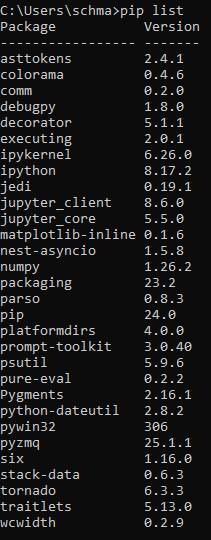
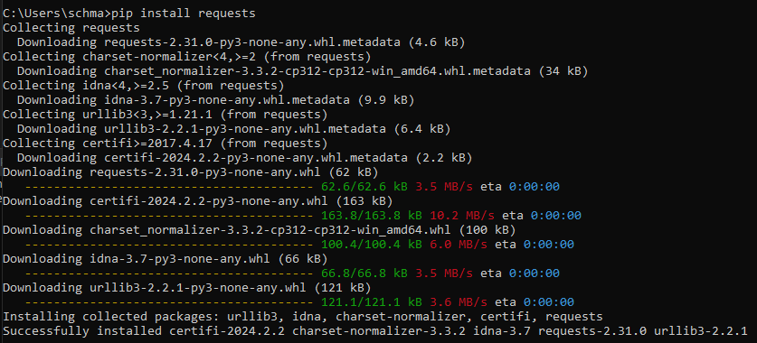
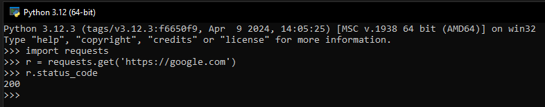
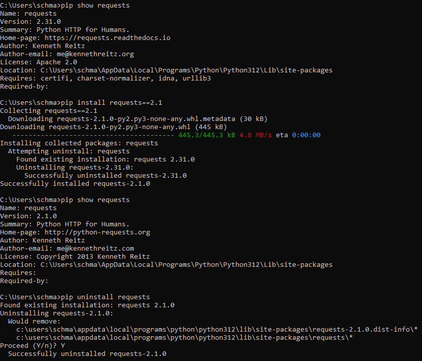

# Звіт до роботи №1
## Тема: Віртуальні середовища
### Мета роботи: 
Ознайомитись із основами віртуальних середовищ та навчитися працювати із ними.

---
### Виконання роботи
1. Результати виконання завдання 1 - "Основи роботи з сторонніми бібліотеками":
    - Перевірили, що pip встановлений на ноутбуці, а саме його версія 24.0
    - Вивели на екран встановленні бібліотеки pip за допомогою команди `pip list`:

    

    - Встановили бібліотеку requests за допомогою команди `pip install requests`:

    

    - Імпортували та протестували її за допомогою команд:

    ```python
    >>> import requests
    >>> r = requests.get('https://google.com')
    >>> r.status_code
    ```

    

    - Зробили її загальнодоступною для цілої системи за допомогою наступних команд:

    ```python
    pip show requests
    pip install requests==2.1
    pip show requests
    pip uninstall requests
    ```
    
      


1. Робота з Python Notebook:
    1. Створили перший файл Python з розширенням `.ipynb` у папці `lab_1` з ім'ям `my_first_pyapp.ipynb`.
    1. Програма вивела наступні значення:
    
    *Maksym start programming at 2023-11-12 17:37:30.646989. Skole is the best city!*

    Це також можна побачити на скіршоті нижче:

    * вставлені рисунки (скріншоти екрана або фотографії виконаного завдання у зошиті);


- Робота з Markdown:
    1. Створили комірку Markdown у файлі з ім'ям `my_first_pyapp.py`.
    1. Описали вище наведений код як:
    
    *Моя перша програма із Python Notebook!*

    1. Натиснули `RunAll` та прослідкували як змінився вигляд Notebook.
    1. Зробили опис коду у вигляді заголовку, тобто додали до Markdown знак `#` на початок комірки.

    Результат можна побачити на скіршоті нижче:

    * вставлені рисунки (скріншоти екрана або фотографії виконаного завдання у зошиті);


- вставлений код / текстовий або числовий результат / інші результати:
```python
print("Привіт! Це проста програма на Python.")

name = input("Будь ласка, введіть ваше ім'я: ")

print(f"Приємно познайомитися, {ім_я}!")
```
```text
Пояснення коду:

1. print("Привіт! Це проста програма на Python."): Цей рядок виводить привітання на екран за допомогою функції print().

2. ім_я = input("Будь ласка, введіть ваше ім'я: "): Цей рядок використовує функцію input(), щоб запросити користувача ввести своє ім'я. Введені дані зберігаються у змінній ім_я.

3. print(f"Приємно познайомитися, {ім_я}!"): Цей рядок виводить персоналізоване привітання, використовуючи значення, введене користувачем, за допомогою форматування рядка (f-строки).
```

### Висновок: 
- :question: Що зроблено в роботі :arrow_down: 

У цій роботі ми створили свій перший *Python*-файл та запрограмували свою прешу програму мовою *Python* у нашому репозиторію *GitHub*. Ми запустили програму та отримали правильний результат, а також визначили, що наша перша програма працює. Далі ми створили *Python Notebook* файл, у якому запустили ту саму програму та за допомогою комірки *Markdown* описали нашу програму. Наприкінці ми відредагували наш *Markdown* так, щоб він виглядав як заголовок.
- :question: Чи досягнуто мети роботи :arrow_down: 

Так, ми навчилися працювати із базовими засобами Python у Visual Studio Code. Ознайомились із роботою у Python Notebook та навчитися працювати із коміркою Markdown.
- :question: Які нові знання отримано :arrow_down:

Я отримав базові знання про роботу з Python у середовищі Visual Studio Code.
- :question: Чи вдалось відповісти на всі питання задані в ході роботи :arrow_down:

Так, на всі питання були дані повноцінні відповіді.
- :question: Чи вдалося виконати всі завдання :arrow_down:

Так, всі завдання були опрацьовані та виконані.
- :question: Чи виникли складності у виконанні завдання :arrow_down:

Ні, виконання лабораторної роботи було безперешкодним.
- :question: Чи подобається такий формат здачі роботи (Feedback) :arrow_down:

Так, це достатньо простий та добре структурований формат здачі завдання, у якому можна достатньо легко показати результати виконаних завдань.
- :question: Побажання для покращення (Suggestions) :arrow_down:

Немає!

---