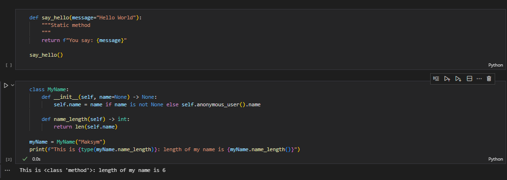
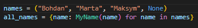

# Звіт до роботи №2
## Тема: Знайомство з ООП
### Мета роботи: 
Ознайомитись з основами роботи з ООП.

---
### Виконання роботи
1. Результати виконання завдання 1 - "Створюємо перший class":
    - Створили два python файли із назвами `lab_2.ipynb` та `lab_2.py`.
    - Скопіювали даний у завданні код у `lab_2.py`:

    ```python
    
    class MyName:
        """Опис класу / Документація
        """
        total_names = 0 #Class Variable

        def __init__(self, name=None) -> None:
            self.name = name if name is not None else self.anonymous_user().name #Class attributes / Instance variables
            MyName.total_names += 1 #modify class variable
            self.my_id = self.total_names

        @property
        def whoami(self): 
            """Class property
            return: повертаємо імя 
            """
            return f"My name is {self.name}"
        
        @property
        def my_email(self) -> str:
            """Class property
            return: повертаємо емейл
            """
            return self.create_email()
        
        def create_email(self) -> str:
            """Instance method
            """
            return f"{self.name}@itcollege.lviv.ua"

        @classmethod
        def anonymous_user(cls):
            """Classs method
            """
            return cls("Anonymous")
        
        @staticmethod
        def say_hello(message="Hello to everyone!"):
            """Static method
            """
            return f"You say: {message}"


    print("Let's Start!")

    names = ("Bohdan", "Marta", None)
    all_names = {name: MyName(name) for name in names}

    for name, me in all_names.items():
        print(f"""{">*<"*20}
    This is object: {me} 
    This is object attribute: {me.name} / {me.my_id}
    This is {type(MyName.whoami)}: {me.whoami} / {me.my_email}
    This is {type(me.create_email)} call: {me.create_email()}
    This is static {type(MyName.say_hello)} with defaults: {me.say_hello()} 
    This is class variable {type(MyName.total_names)}: from class {MyName.total_names} / from object {me.total_names}
    {"<*>"*20}""")

    print(f"We are done. We create {me.total_names} names! ??? Why {MyName.total_names}?")
    ```

    - Скомпілювали код та вивели наступний результат:

    ```
    Let's Start!
    >*<>*<>*<>*<>*<>*<>*<>*<>*<>*<>*<>*<>*<>*<>*<>*<>*<>*<>*<>*<
    This is object: <__main__.MyName object at 0x0000025BB54D08C0> 
    This is object attribute: Bohdan / 1
    This is <class 'property'>: My name is Bohdan / Bohdan@itcollege.lviv.ua     
    This is <class 'method'> call: Bohdan@itcollege.lviv.ua
    This is static <class 'function'> with defaults: You say: Hello to everyone! 
    This is class variable <class 'int'>: from class 4 / from object 4
    <*><*><*><*><*><*><*><*><*><*><*><*><*><*><*><*><*><*><*><*>
    >*<>*<>*<>*<>*<>*<>*<>*<>*<>*<>*<>*<>*<>*<>*<>*<>*<>*<>*<>*<
    This is object: <__main__.MyName object at 0x0000025BB54D08F0> 
    This is object attribute: Marta / 2
    This is <class 'property'>: My name is Marta / Marta@itcollege.lviv.ua
    This is <class 'method'> call: Marta@itcollege.lviv.ua
    This is static <class 'function'> with defaults: You say: Hello to everyone!
    This is class variable <class 'int'>: from class 4 / from object 4
    <*><*><*><*><*><*><*><*><*><*><*><*><*><*><*><*><*><*><*><*>
    >*<>*<>*<>*<>*<>*<>*<>*<>*<>*<>*<>*<>*<>*<>*<>*<>*<>*<>*<>*<
    This is object: <__main__.MyName object at 0x0000025BB54D0920>
    This is object attribute: Anonymous / 4
    This is <class 'property'>: My name is Anonymous / Anonymous@itcollege.lviv.ua
    This is <class 'method'> call: Anonymous@itcollege.lviv.ua
    This is static <class 'function'> with defaults: You say: Hello to everyone!
    This is class variable <class 'int'>: from class 4 / from object 4
    <*><*><*><*><*><*><*><*><*><*><*><*><*><*><*><*><*><*><*><*>
    We are done. We create 4 names! ??? Why 4?
    ```

    - Виконали приклади які розглядали на лекції, вставивши їх у `lab_2.ipynb` та протестувавши:

    

    - Детально ознайомившись із кодом та дізнавшись функцію кожного рядка зрозуміли, що цей код визначає клас Python MyNameз різними методами та властивостями, створює деякі екземпляри цього класу, а потім виводить деяку інформацію про ці екземпляри. Клас має змінну класу total_names, яка відстежує загальну кількість створених екземплярів, і кожен екземпляр має унікальний ідентифікатор на основі поточного значення total_names. Клас також має методи для створення анонімних користувачів, генерації адрес електронної пошти та друку повідомлень. Код створює словник MyName-екземплярів, по одному для кожного імені в кортежі, а потім циклічно переглядає цей словник, щоб надрукувати інформацію про кожен екземпляр. Код також містить деякі анотації типів, щоб вказати типи різних методів і властивостей.

    - Модифікували програму додавши власне ім'я:

    

    ```
    <*><*><*><*><*><*><*><*><*><*><*><*><*><*><*><*><*><*><*><*>
    >*<>*<>*<>*<>*<>*<>*<>*<>*<>*<>*<>*<>*<>*<>*<>*<>*<>*<>*<>*<
    This is object: <__main__.MyName object at 0x000001F72E730980>
    This is object attribute: Maksym / 3
    This is <class 'property'>: My name is Maksym / Maksym@itcollege.lviv.ua
    This is <class 'method'> call: Maksym@itcollege.lviv.ua
    This is static <class 'function'> with defaults: You say: Hello to everyone!
    This is class variable <class 'int'>: from class 5 / from object 5
    <*><*><*><*><*><*><*><*><*><*><*><*><*><*><*><*><*><*><*><*>
    >*<>*<>*<>*<>*<>*<>*<>*<>*<>*<>*<>*<>*<>*<>*<>*<>*<>*<>*<>*<
    ```

    - Відповіді на запитання:
        - ***Чому коли передаємо значення `None` створюється обєкт з іменем `Anonymous`?*** 
        Це через спосіб `__init__` визначення методу для `MyName` класу. Якщо `name` параметр не надано під час створення нового екземпляра класу, `name` параметр за умовчанням має значення `None`. У цьому випадку `__init__` метод викликає `anonymous_user` метод класу, який повертає новий `MyName` екземпляр з назвою «Anonymous».
        - ***Як змінити текст привітання при виклику методу `say_hello()`? Допишіть цю частину коду.***

### Висновок: 
Я ознайомився з основами роботи з ООП.

---