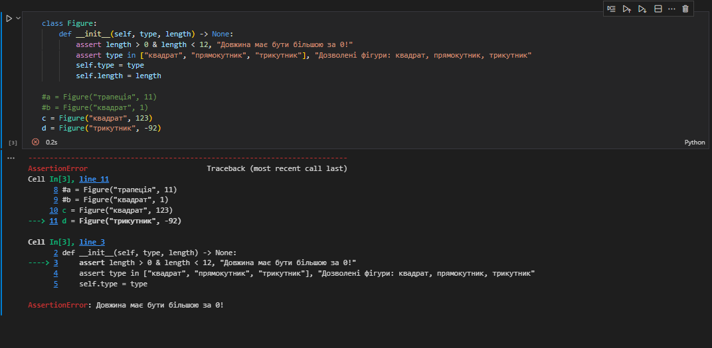
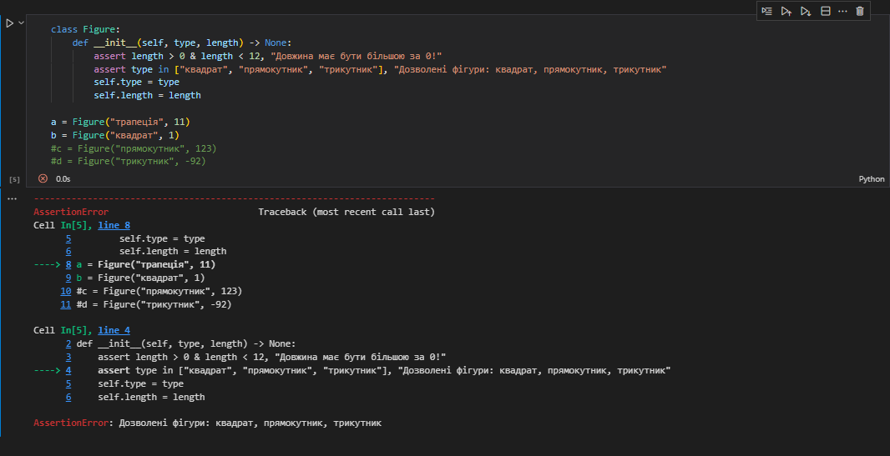
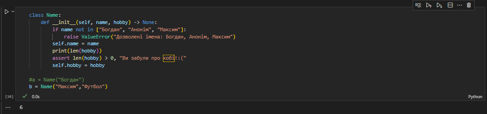
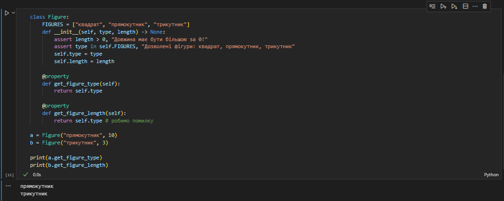
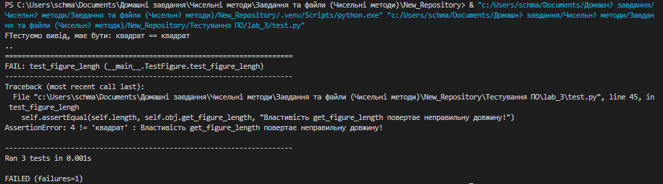
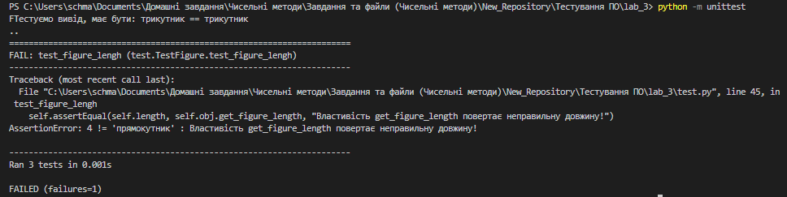
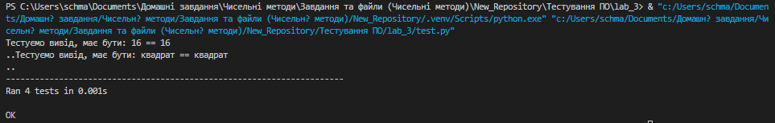
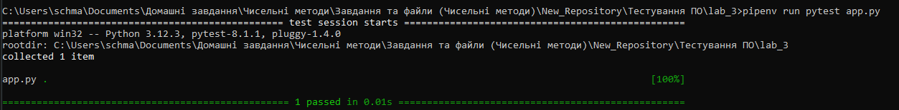
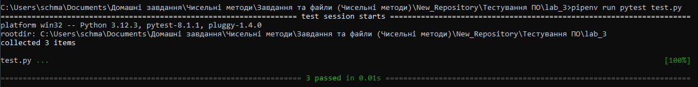

# Звіт до роботи №3
## Тема: Тестування
### Мета роботи: 
Навчитися виконувати тестування.

---
### Виконання роботи
1. Результати виконання завдання 1 - "Перевірка assert":
    - Створили власний крок `assert` та протестували його при введені даних з клавіатури використавши метод `input`:

    ```python
    a = input("Введіть номер квитка: ")
    assert a.isdigit(), "Потрібно ввести число!"
    print(f"Ваш номер квитка: {a}")
    ```
    Результат успішного тестування:
    ```
    PS C:\Users\schma\Documents\Домашні завдання\Чисельні методи\Завдання та файли (Чисельні методи)\New_Repository> & "c:/Users/schma/Documents/Домашн? завдання/Чисельн? методи/Завдання та файли (Чисельн? методи)/New_Repository/.venv/Scripts/python.exe" "c:/Users/schma/Documents/Домашн? завдання/Чисельн? методи/Завдання та файли (Чисельн? методи)/New_Repository/Тестування ПО/lab_3/test.py"
    Введіть номер квитка: 723
    Ваш номер квитка: 723
    ```

    - Здійснили валідацію даних класу `Figure` за допомогою власного коду та заодно протестували його для різних об'єктів:

    ```python
    class Figure:
        def __init__(self, type, length) -> None:
            assert length > 0 & length < 12, "Довжина має бути більшою за 0!"
            assert type in ["квадрат", "прямокутник", "трикутник"], "Дозволені фігури: квадрат, прямокутник, трикутник"
            self.type = type
            self.length = length

    #a = Figure("трапеція", 11)
    #b = Figure("квадрат", 1)
    c = Figure("квадрат", 123)
    d = Figure("трикутник", -92)
    ``` 
    

    ```python
    class Figure:
        def __init__(self, type, length) -> None:
            assert length > 0 & length < 12, "Довжина має бути більшою за 0!"
            assert type in ["квадрат", "прямокутник", "трикутник"], "Дозволені фігури: квадрат, прямокутник, трикутник"
            self.type = type
            self.length = length

    a = Figure("трапеція", 11)
    b = Figure("квадрат", 1)
    #c = Figure("прямокутник", 123)
    #d = Figure("трикутник", -92)
    ```
    

    - Використали умовне розгалуження для перевірки даних. Додавши власне ім'я в перевірку та створивши власний блок та аргумент хоббі протестували `assert` наступним способом:

    ```python
    class Name:
        def __init__(self, name, hobby) -> None:
            if name not in ["Богдан", "Анонім", "Максим"]:
                raise ValueError("Дозволені імена: Богдан, Анонім, Максим")
            self.name = name
            print(len(hobby))
            assert len(hobby) > 0, "Ви забули про хобі!:("
            self.hobby = hobby

    #a = Name("Богдан")
    b = Name("Максим","Футбол")
    ```
    

1. Результати виконання завдання 2 - "Юніт тести":
    - Створили простий клас з двома пропертями, та навмисно зробили в ньому помилку. За допомогою даного класу та створених у нього двох об'єктів для виклику меодів пропертіс застосували його:

    ```python
    class Figure:
        FIGURES = ["квадрат", "прямокутник", "трикутник"]
        def __init__(self, type, length) -> None:
            assert length > 0, "Довжина має бути більшою за 0!"
            self.length = length
            assert type in self.FIGURES, "Дозволені фігури: квадрат, прямокутник, трикутник"
            self.type = type
            
        @property
        def get_figure_type(self):
            return self.type

        @property
        def get_figure_length(self):
            return self.type # робимо помилку

    a = Figure("прямокутник", 10)
    b = Figure("трикутник", 3)

    print(a.get_figure_type)
    print(b.get_figure_length)
    ```
    

    - Створили юніт тести та перевірили тестовий клас: 

    ```python
    import unittest 
    from random import choice, randint 

    class Figure:
        FIGURES = ["квадрат", "прямокутник", "трикутник"]
        def __init__(self, type, length) -> None:
            assert length > 0, "Довжина має бути більшою за 0!"
            assert type in self.FIGURES, "Дозволені фігури: квадрат, прямокутник, трикутник"
            self.type = type
            self.length = length

        @property
        def get_figure_type(self):
            return self.type

        @property
        def get_figure_length(self):
            return self.type # робимо помилку


    class TestFigure(unittest.TestCase):
        @classmethod
        def setUpClass(cls):
            """Виконається лише раз на початку тестів
            """
            pass
        
        def setUp(self) -> None:
            """Виконується кожного разу коли запускається тест
            """
            self.figure = choice(Figure.FIGURES)
            self.length = randint(1, 10)
            self.obj = Figure(self.figure, self.length)
            return super().setUp()

        def tearDown(self) -> None:
            del self.obj
            return super().tearDown()

        def test_figure_type(self):
            print(f"Тестуємо вивід, має бути: {self.figure} == {self.obj.get_figure_type}")
            self.assertEqual(self.figure, self.obj.get_figure_type, "Властивість get_figure_type повертає неправильну фігуру!")

        def test_figure_lengh(self):
            self.assertEqual(self.length, self.obj.get_figure_length, "Властивість get_figure_length повертає неправильну довжину!")
        
        def test_obj(self):
            with self.assertRaises(AssertionError):
                Figure("коло", 1) # Спробуємо створити обєкт з недозволеними параметрими, в нас має бути помилка AssertionError


    if __name__ == '__main__':
        unittest.main() # unittest.main(verbosity=2) щоб був більш детальний вивід
    ```

    - Виконали тест способом через Visual Studio Code:
    

    - Виконали тест способом через консоль:
    

    Можемо зауважити, що `test_figure_type` виконується (оскільки написаний без помилки), а `test_figure_length` провалився, тому що написаний з помилкою.

    - Розширили функціонал класу додавши метод `get_area`, який генерує випадкову ширину для прямокутника та висоту для трикутника, а потім перевіряє, чи `get_area` повертає метод правильну площу для фігури. Тест також друкує очікувані та фактичні значення площі для цілей налагодження. Клас `get_area` я оформив таким чином:

    ```python
    def __init__(self, type, length) -> None:
        assert length > 0, "Довжина має бути більшою за 0!"
        assert type in self.FIGURES, "Дозволені фігури: квадрат, прямокутник, трикутник"
        self.type = type
        self.length = length

    def get_area(self):
        if self.type == "квадрат":
            return self.length ** 2
        elif self.type == "прямокутник":
            width = randint(1, 10)  # генерує випадкову ширину для прямокутника
            return self.length * width
        elif self.type == "трикутник":
            height = randint(1, 10)  # генерує випадкову висоту для трикутника
            return 0.5 * self.length * height
    ```

    Функціонал я також розширив за допомогою перевірки значення `get_area`:

    ```python
    def test_figure_area(self):
        area = self.obj.get_area()
        print(f"Тестуємо вивід, має бути: {area} == {self.obj.get_area()}")
        self.assertEqual(area, self.obj.get_area(), "Метод get_area повертає неправильну площу!")
    ```
    Отримали успішний результат (попередню помилку виправлено):
    

1. Результати виконання завдання 3 - "Юніт тести з використання бібліотеки PyTest":
    - Успішно встановили бібліотеку PyTest.
    - Створимо та додамо простий тест у файлі `app.py` за допомогою даного нам коду:

    ```python
    def test_app_triangle():
        """Test if we create triangle figure.
        """
        fig = "трикутник"
        triangle = Figure(fig, 4)
        assert triangle.type == fig, f"Фігура має бути {fig}"
    ``` 

    Тепер запустимо програму `app.py` за допомогою `pytest` через командну строку:
    

    Як бачимо, тест пройшов гладко.

    - Запустимо всі тести з файлу `test.py`:

    

1. Результати виконання завдання 4 - "Візуалізація результатів та покриття коду Coverage (pytest-cov)":
    - Успішно інсталювали бібліотеку `coverage` та `pytest`.
    - За допомогою команди нижче згенерували дані про покриття:
    
    ```python
    pipenv run python -m coverage run -m unittest discover
    ```

    - Створився файл `.coverage`, тепер можемо генерувати звіт про покритя за допомогою `HTML`. Це я зробив за допомогою цієї команди:

    ```python
    pipenv run python -m coverage html
    ```

    - Результати були успішно звізуалізовані та завантажені у папку `htmlcov`:
    
    [website](/Тестування%20ПО/lab_3/htmlcov/index.html)

### Висновок: 
Я навчився виконувати тестування.

---